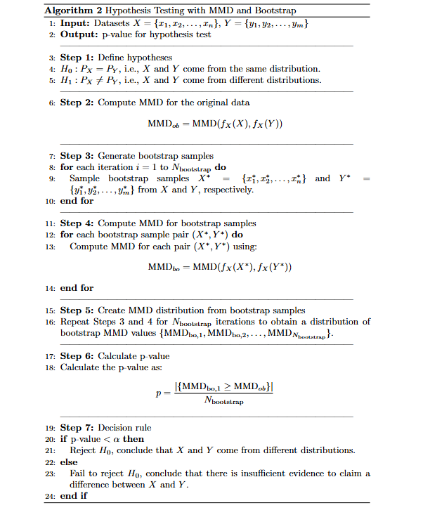
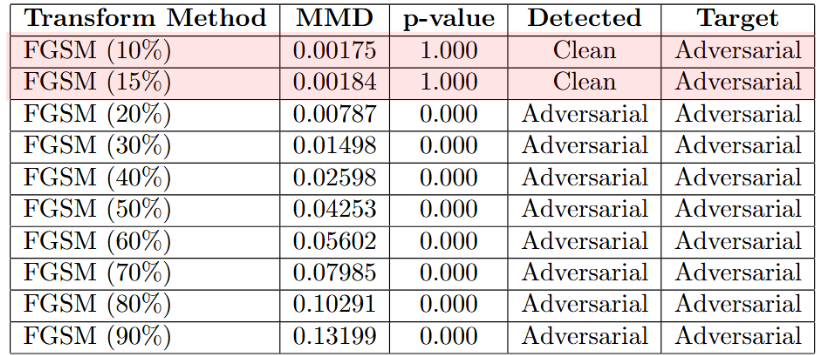
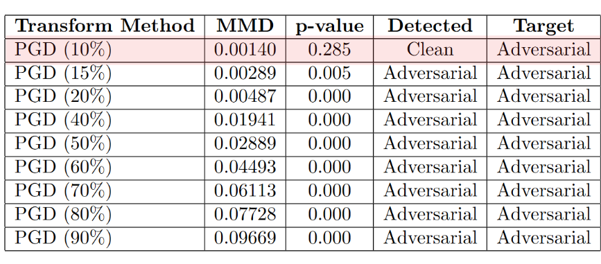

# Adversarial Example Detection using Maximum Mean Discrepancy (MMD) and Bootstrap Hypothesis Test.

The adversarial dataset and the classification model was created by another our project in this link: [Adversarial Robustness of Medical Image Classifiers via Denoised Smoothing](https://github.com/khoa16122004/Adversarial-Robustness-of-Medical-Image-Classifiers-via-Denoised-Smoothing)

## Overview
This project aims to detect adversarial examples in datasets using the Maximum Mean Discrepancy (MMD) and Bootstrap Hypothesis test. 

Adversarial examples are inputs to a machine learning model that are designed to cause the model to misbehave. The MMD test is a statistical test that measures the difference between two distributions.



## Results



## Code Structure

* `hypothesis_test.py`: This file contains the implementation of the MMD test and related functions.
* `create_dataset.py`: This file contains functions for creating and manipulating datasets.
* `data_utils.py`: This file contains utility functions for working with data.
* `test.py`: This file contains the main script for running the MMD test on a dataset.

## Functionality

* The project provides a function `test_distribution_difference` that takes in two datasets and returns the MMD value, p-value, and a boolean indicating whether the null hypothesis (i.e., the two distributions are the same) is rejected.
* The project also provides functions for creating and manipulating datasets, including `create_dataset` and `mix_datasets`.
* The `main` function in `test.py` runs the MMD test on a dataset and prints the results.

## Usage

* Run the MMD test: 

    ```python
    python test.py --adversarial_attack <attack_type> --adversarial_percentage <percentage> --test_size <size> --n_interations <iterations> --test <test_number>
    ```

+ `--adversarial_attack`: type of transforms (FGSM, PGD, flips, subsampling, gaussian_blur)
+ `--adversarial_percentage`: adversarial percentage of full dataset(0.0 - 1.0)
+ `--test_size`: Size of Y dataset
+ `--n_interations`: Number of bootstrap iterations
+ `--test`: Số thử nghiệm

## Requirements

* Python 3.x
* PyTorch
* NumPy
* SciPy
* Argparse

## Notes

* The project assumes that the datasets are stored in a specific format (e.g., PyTorch tensors).
* The project uses the `argparse` library to parse command-line arguments.
